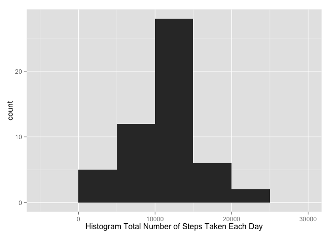
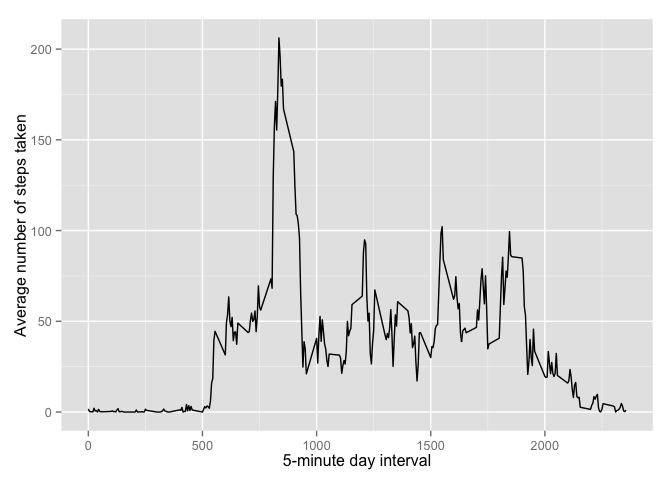
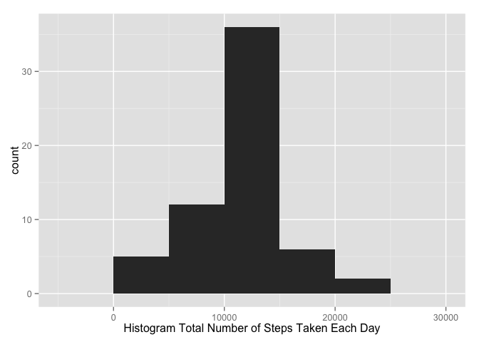
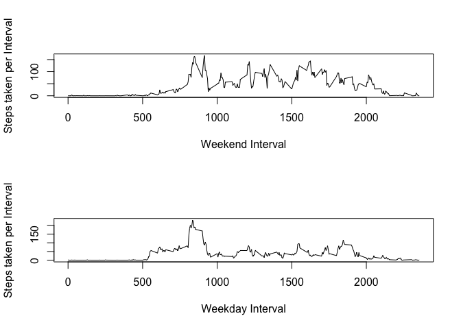

# Reproducible Research: Peer Assessment 1


## Loading and preprocessing the data

The first step is to load the required plyr, and ggplot2 libraries. Then download, unzip and load activity data into activity variable.


```r
# Install plyr library

install.packages("plyr", repos="http://cran.rstudio.com/")
```

```
## Installing package into '/Users/lucia/Library/R/3.2/library'
## (as 'lib' is unspecified)
```

```
## 
## The downloaded binary packages are in
## 	/var/folders/46/jlcscj957rj90tr08jbyh1_w0000gp/T//RtmpOaK1Px/downloaded_packages
```

```r
library(plyr)

# install ggplot2

install.packages("ggplot2", repos="http://cran.rstudio.com/")
```

```
## Installing package into '/Users/lucia/Library/R/3.2/library'
## (as 'lib' is unspecified)
```

```
## 
## The downloaded binary packages are in
## 	/var/folders/46/jlcscj957rj90tr08jbyh1_w0000gp/T//RtmpOaK1Px/downloaded_packages
```

```r
library(ggplot2)

# Download the activity.zip data sets to disk  +++++++++

download.file("https://d396qusza40orc.cloudfront.net/repdata%2Fdata%2Factivity.zip"
                              ,"activity.zip", method="curl")        

# Unzips activity.zip to activity.csv +++++++++++++++++++++++++++

unzip("activity.zip")

# Load the activity data sets into activity dataframe +++++++++++++++++++++++++++

activity <- read.csv("activity.csv")
```

## What is mean total number of steps taken per day?


```r
# Calculate the total number of steps taken per day
 
totalNumberOfStepsPerDay=ddply(subset(activity,is.na(activity$steps)==FALSE), .(date), summarize, steps = sum(steps))

# Histogram plot of the total number of steps taken each day

qplot( steps
       ,data=totalNumberOfStepsPerDay
       ,geom="histogram"
       ,binwidth = 5000
     )+labs(x="Histogram Total Number of Steps Taken Each Day")
```

 

```r
# Calculate the mean of the total number of steps taken per day

mean(totalNumberOfStepsPerDay$steps)
```

```
## [1] 10766.19
```

```r
# Calculate the median of the total number of steps taken per day

median(totalNumberOfStepsPerDay$steps)
```

```
## [1] 10765
```


## What is the average daily activity pattern?


```r
# Plot with the average number of steps taken, averaged across all days (y-axis)

averageNumberOfStepsTakenPerInterval=ddply(subset(activity,is.na(activity$steps)==FALSE), .(interval), summarize, steps = mean(steps))

qplot(  interval
        ,steps
        ,data=averageNumberOfStepsTakenPerInterval
        ,geom="line"
        )+labs(y="Average number of steps taken", x="5-minute day interval")
```

 

```r
# 5-minute interval averaged across all the days in the dataset that contains the maximum number of steps

averageNumberOfStepsTakenPerInterval[averageNumberOfStepsTakenPerInterval$steps==max(averageNumberOfStepsTakenPerInterval$steps),]$interval
```

```
## [1] 835
```


## Imputing missing values

Missing values (NA) will be replaced with the mean from the corresponding 5-minute interval.


```r
#Calculate and report the total number of missing values in the dataset (i.e. the total number of rows with NAs)

sum(is.na(activity$steps))
```

```
## [1] 2304
```

```r
#Create a new dataset (activityModified) that is equal to the original dataset but with the missing data filled in.
#Replace NA in original dataset with mean from corresponding 5-minute interval

activityModified<-activity

for (i in 1:nrow(activityModified))
{
        if(is.na(activityModified[i,]$steps) ==TRUE)
        {
                activityModified[i,]$steps <- subset(averageNumberOfStepsTakenPerInterval,interval==activityModified[i,]$interval)$steps
        }
}


#Make a histogram of the total number of steps taken each day and Calculate and report the mean and median total number of steps taken per day. 
#Do these values differ from the estimates from the first part of the assignment? 
#What is the impact of imputing missing data on the estimates of the total daily number of steps?

# Calculate the total number of steps taken per day

totalNumberOfStepsPerDayModified=ddply(activityModified, .(date), summarize, steps = sum(steps))

# Histogram plot of the total number of steps taken each day

qplot( steps
       ,data=totalNumberOfStepsPerDayModified
       ,geom="histogram"
       ,binwidth = 5000
)+labs(x="Histogram Total Number of Steps Taken Each Day")
```

 

```r
# Calculate the mean of the total number of steps taken per day

mean(totalNumberOfStepsPerDayModified$steps)
```

```
## [1] 10766.19
```

```r
# Calculate the median of the total number of steps taken per day

median(totalNumberOfStepsPerDayModified$steps)
```

```
## [1] 10766.19
```


## Are there differences in activity patterns between weekdays and weekends?


```r
#Create a new factor variable in the dataset with two levels – “weekday” and “weekend” indicating 
#whether a given date is a weekday or weekend day.

weekdays1 <- c('Monday', 'Tuesday', 'Wednesday', 'Thursday', 'Friday')

activityModified$is.Weekday <- factor((weekdays(as.POSIXct(activityModified$date)) %in% weekdays1)
                                        ,levels=c(FALSE, TRUE)
                                        ,labels=c('Weekend', 'Weekday'))


#Make a panel plot containing a time series plot (i.e. type = "l") of the 5-minute interval (x-axis) 
#and the average number of steps taken, averaged across all weekday days or weekend days (y-axis). 

averageNumberOfStepsTakenPerIntervalWeekday=ddply(subset(activityModified,activityModified$is.Weekday=='Weekday'), .(interval), summarize, steps = mean(steps))


averageNumberOfStepsTakenPerIntervalWeekend=ddply(subset(activityModified,activityModified$is.Weekday=='Weekend'), .(interval), summarize, steps = mean(steps))

#Create plot comparison Weekend-Weekday number of steps taken per interval

par(mfrow=c(2,1))

plot(averageNumberOfStepsTakenPerIntervalWeekend$interval
     ,averageNumberOfStepsTakenPerIntervalWeekend$steps
     ,type="l"
     ,ylab="Steps taken per Interval"
     ,xlab="Weekend Interval")

plot(averageNumberOfStepsTakenPerIntervalWeekday$interval
        ,averageNumberOfStepsTakenPerIntervalWeekday$steps
        ,type="l"
        ,ylab="Steps taken per Interval"
        ,xlab="Weekday Interval")
```

 
